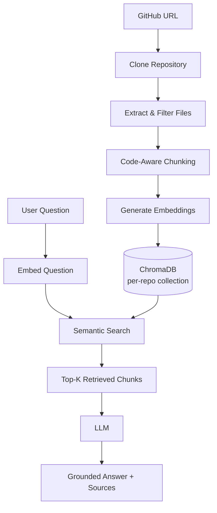

# CodeRAG

Chat with any public GitHub repository using a real Retrieval-Augmented
Generation (RAG) pipeline — no manual setup beyond pasting a repo URL.

## Project Overview

CodeRAG lets you paste a public GitHub repository URL and then ask
natural-language questions about that codebase — "Where is
authentication implemented?", "Explain the login flow", "What
technologies are used?" — and get answers grounded in the actual
source code, with the exact files and line ranges the answer came
from.

Under the hood it clones the repo, splits it into semantically
meaningful chunks (functions, classes, README sections), embeds those
chunks, stores them in a vector database, and retrieves only the most
relevant chunks for each question before asking an LLM to answer using
that retrieved context — never the whole repository.

## What is RAG?

Retrieval-Augmented Generation is a pattern for grounding an LLM's
answers in a specific set of documents (here, a codebase) instead of
relying purely on what the model memorized during training:

1. Your documents are broken into small chunks.
2. Each chunk is converted into a vector ("embedding") that captures
   its meaning.
3. Those vectors are stored in a vector database.
4. When you ask a question, the question is embedded the same way and
   compared against every stored chunk to find the most semantically
   similar ones.
5. Only those top matches — not the whole document set — are handed
   to the LLM as context, along with your question.
6. The LLM answers using that context, and you can see exactly which
   chunks it used.

This keeps answers accurate and grounded, lets the system work on
codebases far larger than any LLM's context window, and makes the
reasoning behind an answer inspectable.

## Why is this a RAG project?

```text
Repository → Chunking → Embeddings → Vector Database → Retrieval → LLM
```

Concretely, in CodeRAG:

- **Repository**: cloned locally with GitPython (`rag/github_loader.py`).
- **Chunking**: code-aware — Python files are split at function/class
  boundaries via `ast`; C-family languages use a structural regex
  scan; everything else falls back to a recursive text splitter
  (`rag/code_chunker.py`).
- **Embeddings**: `sentence-transformers/all-MiniLM-L6-v2`
  (`rag/embeddings.py`).
- **Vector Database**: ChromaDB, one collection per repository
  (`rag/vector_store.py`).
- **Retrieval**: query embedding → cosine similarity search → Top-K
  chunks, with a configurable relevance threshold
  (`rag/retriever.py`).
- **LLM**: an OpenAI-compatible chat model that only ever sees the
  retrieved chunks, never the raw repository (`rag/generator.py`).

The Streamlit UI surfaces every one of these steps explicitly — the
processing checklist during ingestion, the **🔍 Retrieved Context**
expander under every answer, and the **📄 Sources** list — so it's
easy to demonstrate that this is genuinely retrieval-driven and not a
"paste the whole repo into the prompt" chatbot.

## Architecture



## Technology Stack

| Component | Purpose |
|---|---|
| **Streamlit** | Web UI — repo input, processing status, chat interface |
| **LangChain** (`langchain-text-splitters`) | Recursive text splitter used as the chunking fallback for non-code files |
| **Sentence Transformers** (`all-MiniLM-L6-v2`) | Turns text/code chunks and queries into embedding vectors |
| **ChromaDB** | Persistent vector database, one collection per repository |
| **LLM (OpenAI-compatible API)** | Generates grounded answers from retrieved context |
| **GitPython** | Shallow-clones the target repository into a temp directory |

## Project Structure

```text
CodeRAG/
├── app.py                   # Streamlit UI and orchestration
├── rag/
│   ├── github_loader.py     # Clone + repo metadata
│   ├── file_processor.py    # Walk & read files
│   ├── code_chunker.py      # Code-aware chunking
│   ├── embeddings.py        # sentence-transformers wrapper
│   ├── vector_store.py      # ChromaDB wrapper
│   ├── retriever.py         # Top-K semantic retrieval
│   ├── generator.py         # LLM call + grounded answer
│   └── prompts.py           # System / user prompt templates
├── utils/
│   ├── validation.py        # GitHub URL validation
│   ├── file_filters.py      # Include/ignore rules, size limits
│   └── repository_utils.py  # Collection naming, path sanitization
├── data/chroma/              # Persisted vector DB (gitignored)
├── .env.example
├── requirements.txt
└── README.md
```

## Installation

```bash
python -m venv venv
source venv/bin/activate      # Windows: venv\Scripts\activate
pip install -r requirements.txt
```

## Environment Variables

Copy `.env.example` to `.env` and fill in your key:

```bash
cp .env.example .env
```

```text
OPENAI_API_KEY=your-api-key-here
OPENAI_MODEL=gpt-4o-mini
# OPENAI_BASE_URL=https://api.openai.com/v1   # optional, for compatible providers
```

Never hardcode API keys in code — they are only ever read from the
environment.

## Running

```bash
streamlit run app.py
```

## Demo Walkthrough

1. Paste a public GitHub repository URL (e.g.
   `https://github.com/owner/project`) and click **Analyze
   Repository**.
2. Watch the processing checklist: fetching → extracting → chunking →
   embedding → indexing → ready.
3. Ask a question in the chat box, or click one of the **💡 Try
   asking** suggestions.
4. Expand **🔍 Retrieved Context** under the answer to see exactly
   which chunks (file, line range, relevance score) were retrieved
   and handed to the LLM.
5. Check **📄 Sources** for the file list the answer is grounded in.
6. Point out that only those retrieved chunks — not the full
   repository — were sent to the LLM: that's what makes this RAG
   rather than a "stuff everything in the prompt" chatbot.

## Notes on Security & Limits

- Only public repositories are supported.
- Downloaded repository code is never executed.
- `.env` files and anything that looks like it holds credentials are
  excluded from indexing.
- Repository size is capped (file count and total bytes) to keep
  ingestion fast and predictable.
- Each repository gets its own isolated vector collection, keyed by
  owner/repo/commit, so re-analyzing an unchanged repo reuses the
  existing index instead of re-embedding from scratch.
